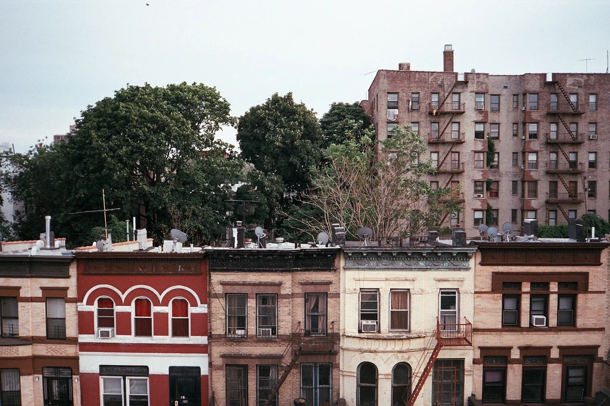

# Hometown Homepage – Crown Heights

A simple hometown landing page built with HTML and CSS showcasing Crown Heights, Brooklyn.

## Live Demo

https://shwarzbergzelda.github.io/Hometown-Homepage/

## About the Project

This project was created as part of the Scrimba Frontend Developer Career Path. The goal was to build a responsive hometown homepage that highlights local attractions and practices fundamental web development concepts.

The page features:

- A hero section with a custom background image
- Featured activities in Crown Heights
- Circular image styling
- Flexbox-based layouts
- A guide card section
- Custom color palette and typography

## Built With

- HTML5
- CSS3
- Flexbox
- Git & GitHub
- GitHub Pages

## What I Learned

Through this project, I practiced:

- Positioning elements with `position: relative` and `position: absolute`
- Creating overlays on images
- Using Flexbox for layout and spacing
- Styling cards and profile sections
- Working with image sizing and `object-fit`
- Deploying a static website with GitHub Pages

## Screenshot

## Future Improvements

- Add hover effects and animations
- Improve mobile responsiveness
- Add more information about local attractions
- Include navigation links to different sections
- Enhance accessibility features

## Author

**Zelda Shwarzberg**

GitHub: https://github.com/shwarzbergzelda

---

Created as part of the Scrimba Frontend Developer Career Path.
